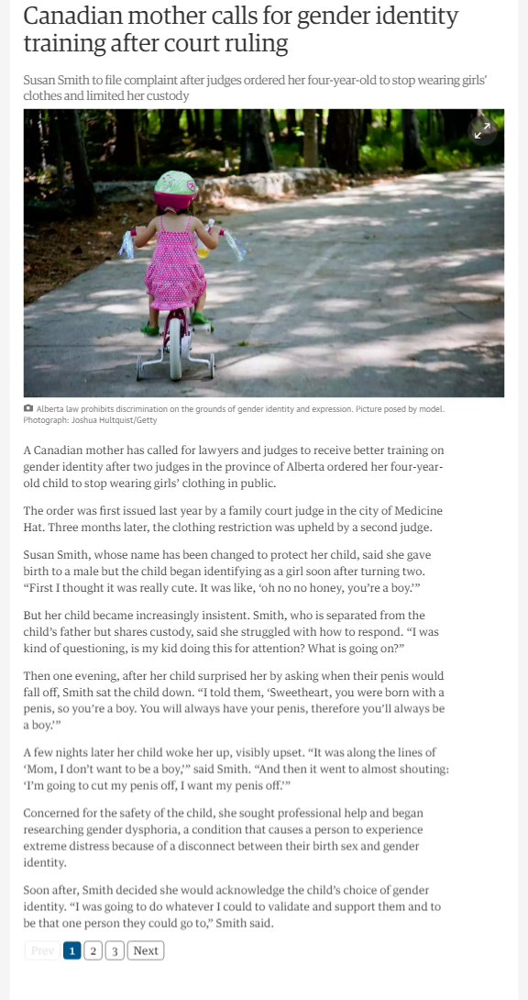
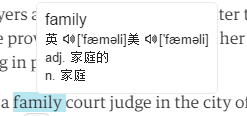

# SPARE
更好的阅读体验

## 功能

- 内容过滤掉  

    对 theguardian (卫报)所有文章页面多余内容过滤(首页、分类页不过滤)

- 正文分页

    根据屏幕的大小进行分页     
    以 ipad(768 x 1024)、iphone6P(414 x 763)、iPhone4(320 x 480)分四类
    
    

- 取词查询

    通过双击或者选择单词在弹出框里显示单词的发音和含义   
    支持所有页面取词查询发音
    
    打开/关闭取词 

    `ctrl`+`alt`+`q`

    示例：

    

## 开发文档

        npm install
        gulp dev

目录结构

      spare
        ├──build              // 编译目录
            └──assets         // 编译压缩之后的项目代码
        ├──gulp               // gulp任务
        ├──src                // 开发目录
            ├──imgs           // 图片
            └──js             // js目录
                ├──lib        // js第三方包
                └──view       // 项目js
            ├──scss           // scss文件
            ├──view           // 项目视图HTML
            └──mainfes.json   // chrome配置文件
        ├──gulpfile.js        // gulp配置文件
        └──package.json       // npm包

## 补充

- 直接扩展安装的crx在build目录下 `assets.crx`
- 开发模式下安装的是在 build/asstes 文件夹里

## 更新

- 修复分页问题 V0.2

